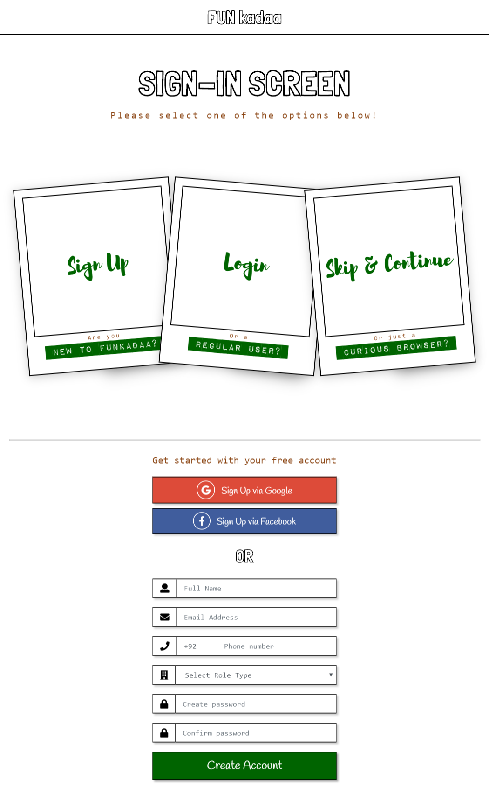
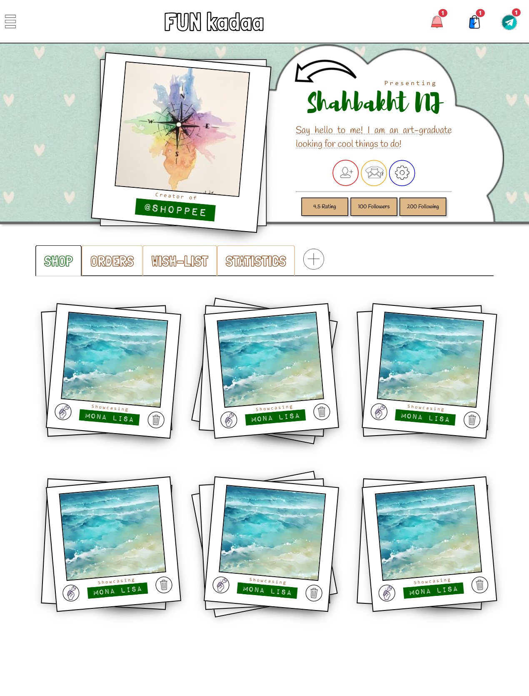
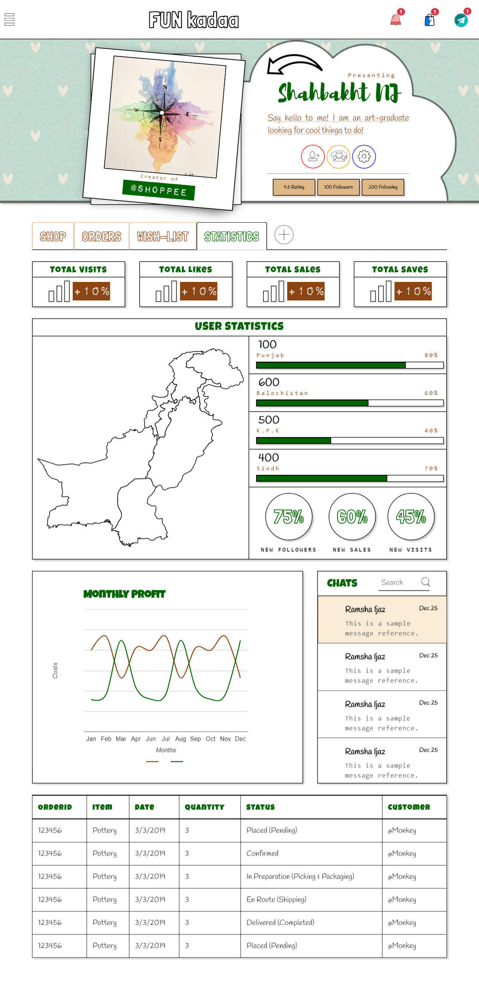
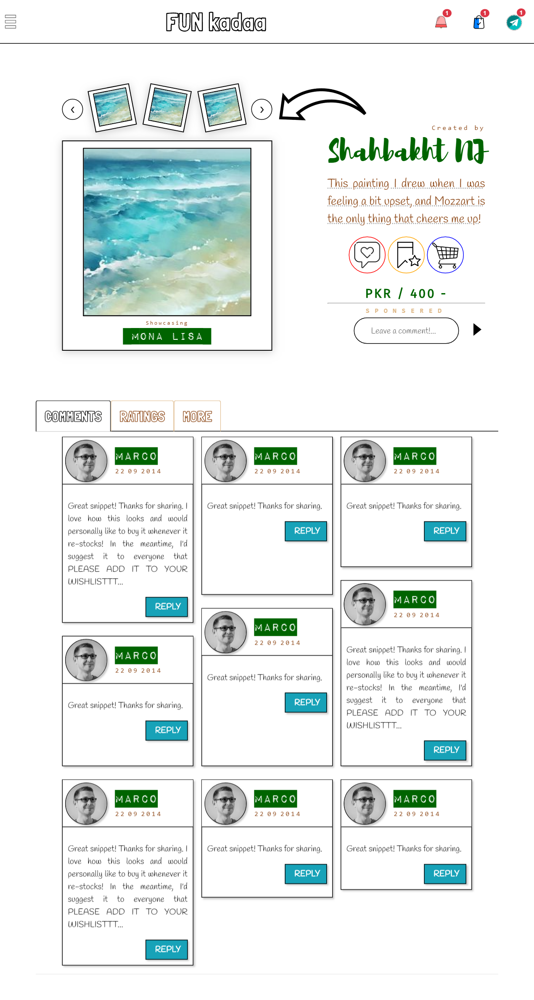
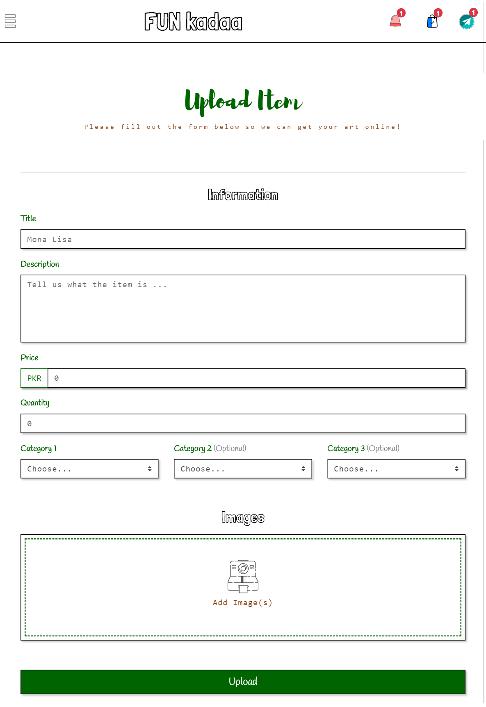
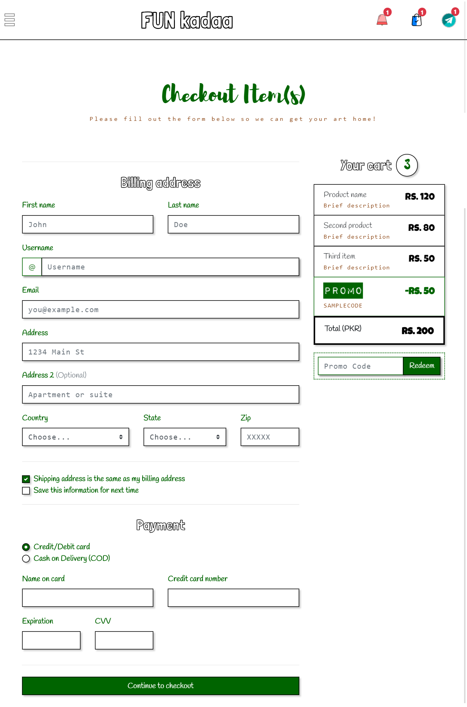

# FunKadaa
Launched in 2017, Funkadaa is a privately-owned limited liability company. We aim to target artists from all over Pakistan to showcase their art products on our platform. We intend to market their talents and advertise our platform in order to gain attention from art admirers and seek customers. The documents propose a business plan for our company along with the financial plan, damaged control plan cash flow assessment for a year. The prototype is available (open source) in this GitHub Repository.
<h4> Website Link: http://funkadaa.epizy.com </h4>
<h4> Facebook Page: https://facebook.com/FunKadaa/ </h4>
<h4>Prototype Screenshots: </h4>
<h5>⦿ Sign-In and Profile Posts</h5>

  
  

<h5>⦿ Profile Stats, Newsfeed and Posts</h5>

  
  
  

<h5>⦿ Upload and Checkout</h5>

  
  

<h4>Previous Versions</h4>
<h5> 2018: http://funkadaa.herokuapp.com </h5>
<h5> 2017: http://funkadaa.com </h5>
